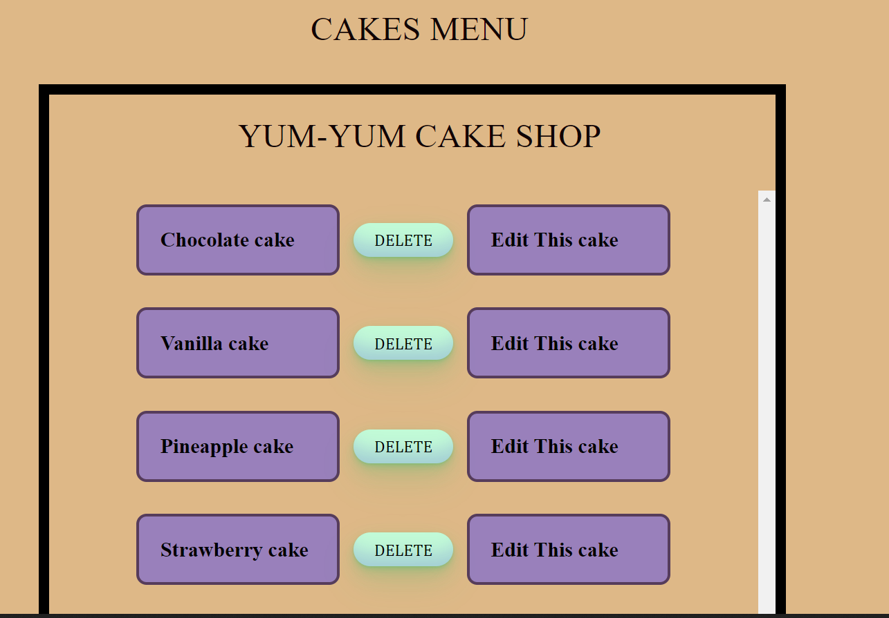
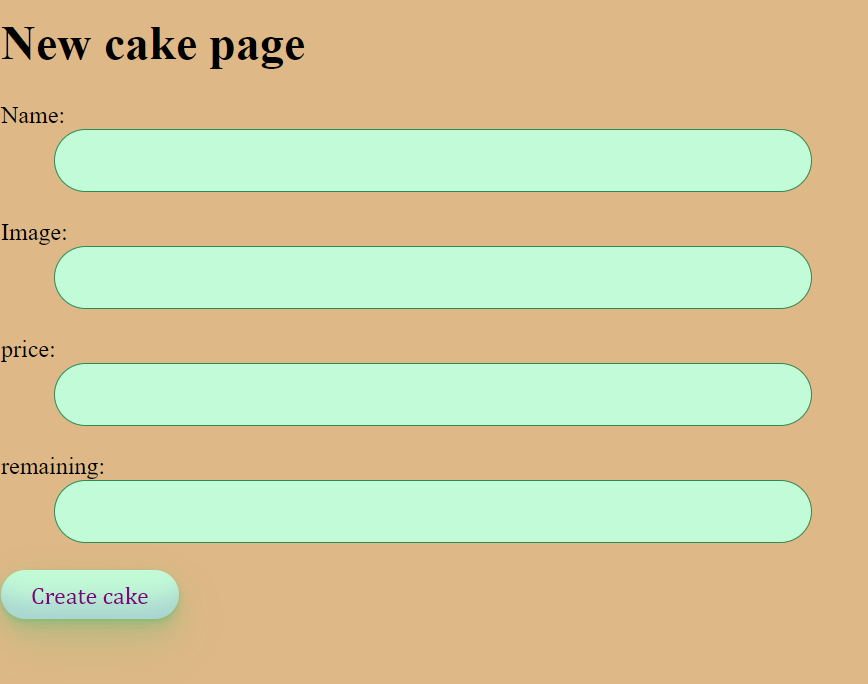
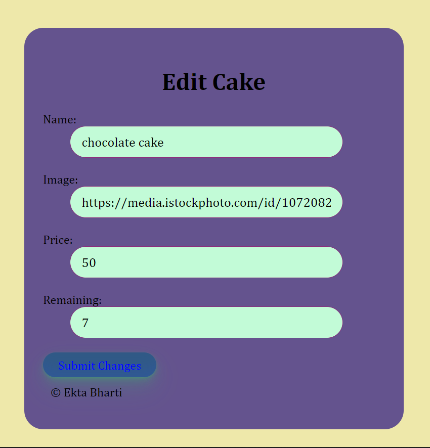

 # YUM-YUM CAKE SHOP

 ## Motivation
 
 Yum-Yum Cake Shop is a bakery store that brings sweetness in peoples lives.Here you can add different types of cakes, muffins and pies.You can have these unforgettable tastes.

 ## About the project
* This website looks like a cake shop website.Here we can add bakrery items and edit them according to stock available.
* Customers can go to Menu and can buy cakes or other baked food items
## Screenshots

## YouTube Link

[youtubelink1](https://youtu.be/HYLGYsjcI_k)

[youtubelink2](https://youtu.be/8S97aLb4KcQ)

## GitHub Access
[githublink](https://github.com/ektapass/cakeshop.git)

## Live Site
[Link](https://ektas-cake-shop.onrender.com)

## Technologies used

* React.js for front-end development.
* Node.js as runtime environment of JS.
* Mongoose as library for MongoDB
* Express.js as framework.
* MongoDB as database for storing data.

## Acknowledgements

Thankful to my instructors 
 **Tishana Trainor** and
 **Kasper Kain**  and my classmates.

## Resources

* https://www.w3schools.com/css/default.asp

* https://developer.mozilla.org/en-US/docs/Web/CSS

* https://www.freecodecamp.org/news/tag/css/
